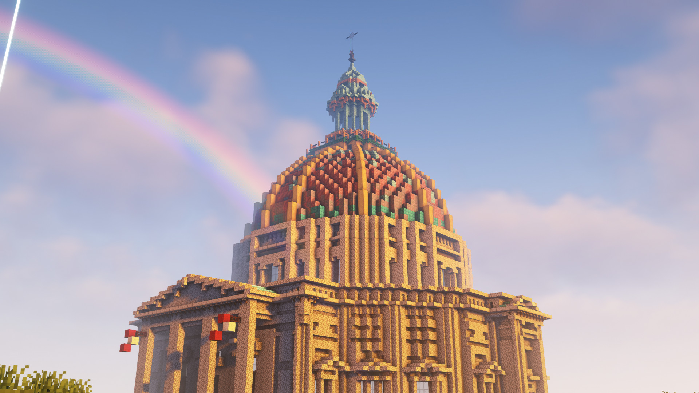

Anprim E-Sports is an SMP Minecraft server. While the server attempts to maintain a vanilla experience we utilize a modded fabric instance to improve performance and add quality of life adjustments; the modpack along with an installation guide can be found [here](/modpack).

Before joining please read the [rules](/rules).

Join now at, <button style="background: none; color: inherit; border: none; padding: 0; font: inherit; cursor: pointer; outline: none; border-bottom: 1px solid var(--textColour);" onclick="copyToClipboard()"><code>anprimesports.org</code></button>.
